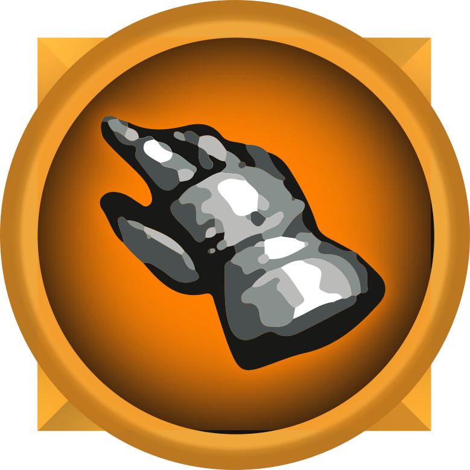

[![Contributors][contributors-shield]][contributors-url]
[![Forks][forks-shield]][forks-url]
[![Stargazers][stars-shield]][stars-url]
[![Issues][issues-shield]][issues-url]

<!-- PROJECT LOGO -->
 

  

  <h3 align="center">World of Clickcraft</h3>

  

    A WoW Clicker
     
     
    <a href="https://flotib.github.io/World-of-Clickcraft">Play the game</a>
    ·
    <a href="https://github.com/flotib/World-of-Clickcraft/issues">Report Bug</a>
    ·
    <a href="https://github.com/flotib/World-of-Clickcraft/issues">Request Feature</a>
  

<!-- TABLE OF CONTENTS -->

  
<h2 style="display: inline-block">Table of Contents</h2>

  <ol>
    <li>
      <a href="#about-the-project">About The Project</a>
      <ul>
        <li><a href="#built-with">Built With</a></li>
      </ul>
    </li>
    <li><a href="#getting-started">Getting Started</a></li>
    <li><a href="#content">Content</a></li>
    <li><a href="#todo-list">Todo-list</a></li>
    <li><a href="#contributing">Contributing</a></li>
    <li><a href="#license">License</a></li>
    <li><a href="#contact">Contact</a></li>
    <li><a href="#acknowledgements">Acknowledgements</a></li>
  </ol>

<!-- ABOUT THE PROJECT -->
## About The Project

[![Product Name Screen Shot][product-screenshot]](https://example.com)

World of Clickcraft is an idle game (aka clicker game like Cookie Clicker).
I started with this project because I always wanted to do my own clicker game and I'm a big World of Warcraft fan.

### Built With

* [HTML](https://github.com/topics/html)
* [CSS](https://github.com/topics/css)
* [VueJS](https://github.com/topics/vuejs)

<!-- GETTING STARTED -->
## Getting Started

Download the repository and open index.html in your favorite web browser or try the latest version [here](https://flotib.github.io/World-of-Clickcraft).

<!-- USAGE EXAMPLES -->
## Content

* Clicks!
* Fully working leveling
* Progression
* Currency system
* WoW vibes

## Todo-list

* Sounds
* Character inventory
* Shop
* Upgrades
* Stats
* Tons of items
* Saves and load
* "Ascension"
* Talents tree
* Dungeons and raids
* Minigames
* Hidden lore and references
* And many other things

<!-- CONTRIBUTING -->
## Contributing

Contributions are what make the open source community such an amazing place to be learn, inspire, and create. Any contributions you make are **greatly appreciated**.

1. Fork the Project
2. Create your Feature Branch (`git checkout -b feature/AmazingFeature`)
3. Commit your Changes (`git commit -m 'Add some AmazingFeature'`)
4. Push to the Branch (`git push origin feature/AmazingFeature`)
5. Open a Pull Request

<!-- LICENSE -->
## License

Distributed under the MIT License.

<!-- CONTACT -->
## Contact

Discord: Flotib#7171 
Twitter: [@_Flotib](https://twitter.com/_flotib)

<!-- ACKNOWLEDGEMENTS -->
## Acknowledgements

* [Caceresenzo](https://github.com/Caceresenzo) who is always here to help me
* 
* 

<!-- MARKDOWN LINKS & IMAGES -->
<!-- https://www.markdownguide.org/basic-syntax/#reference-style-links -->
[contributors-shield]: https://img.shields.io/github/contributors/flotib/repo.svg?style=for-the-badge
[contributors-url]: https://github.com/flotib/World-of-Clickcraft/graphs/contributors
[forks-shield]: https://img.shields.io/github/forks/flotib/World-of-Clickcraft.svg?style=for-the-badge
[forks-url]: https://github.com/flotib/World-of-Clickcraft/network/members
[stars-shield]: https://img.shields.io/github/stars/flotib/World-of-Clickcraft.svg?style=for-the-badge
[stars-url]: https://github.com/flotib/World-of-Clickcraft/stargazers
[issues-shield]: https://img.shields.io/github/issues/flotib/World-of-Clickcraft.svg?style=for-the-badge
[issues-url]: https://github.com/flotib/World-of-Clickcraft/issues
[license-shield]: https://img.shields.io/github/license/flotib/World-of-Clickcraft.svg?style=for-the-badge
[license-url]: https://github.com/flotib/World-of-Clickcraft/blob/master/LICENSE.txt
